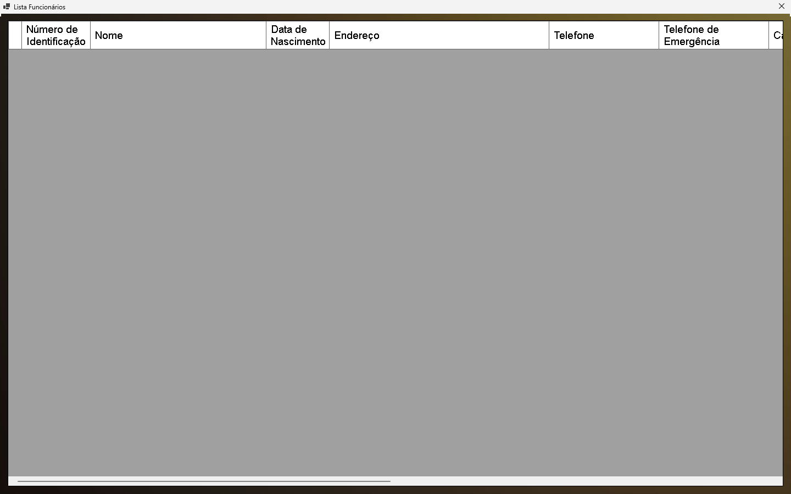

# Pãobom: Sistema de Gestão de Vendas para Padarias

# O que é o 'Pãobom'?
O Pãobom é um sistema de gestão de vendas desenvolvido como projeto de conclusão de curso na disciplina de Desenvolvimento de Aplicações. Criado especificamente para atender às necessidades de uma padaria, essa aplicação oferece uma solução abrangente para gerenciar as vendas, funcionários e estoque de forma eficiente.

# Como funciona?
Desenvolvido em C# utilizando a plataforma Windows Forms, o Pãobom oferece uma interface intuitiva e amigável para os usuários. Com recursos como cadastro de produtos, controle de vendas, a aplicação simplifica as operações diárias de uma padaria, proporcionando maior organização e controle sobre o negócio.

# Resolução 1440x900

  
# Demonstração
<h2>Inicio</h2>
A imagem abaixo mostra a tela inicial da aplicação, onde os usuários podem iniciar suas operações e acessar facilmente os diferentes recursos oferecidos pelo Pãobom.

<h2>Menu Principal</h2>
A imagem abaixo mostra o menu principal da aplicação, onde os usuários podem efetuar a venda de seus produtos.

<h2>Cadastro de funcionários e produtos</h2>
A imagem abaixo mostra o cadastro da aplicação, onde os usuários podem efetuar o cadastro de seus funcionários e de seus produtos.

<h2>Lista funcionários e produtos</h2>
A imagem abaixo mostra a listagem da aplicação, onde os usuários podem visualizar o cadastro de seus funcionários e de seus produtos.

<h2>Vendas</h2>
A imagem abaixo mostra o gerenciamento de vendas da aplicação, onde os usuários podem visualizar as vendas efetuadas.

# Alterações a ser feitas
- Adicionar alteração e remoção de produto/funcionários.
- Filtro de pesquisa em vendas, funcionários e produtos.
- Bug presente no valor total (A soma não é efetuada quando mais de um produto é adicionado e a multiplicação não é feita corretamente).
- Modificar as MaskedTextBox dos valores (No atual momento elas estão formatadas da seguinte maneira 'R$  ____,__'), minha ideia é remover o 'R$ ' e adiciona-lo como label.
- Ao finalizar a compra a forma crédito não está sendo efetuada da maneira correta (Algum erro na instancia e no showdialog do formulário parcelas).
